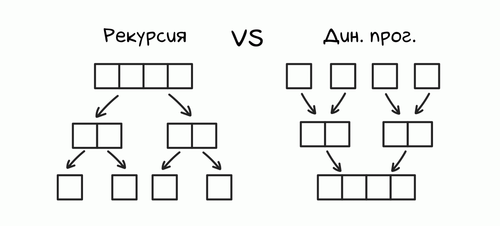

# Динамическое программирование
"Динамическое программирование — это когда у нас есть задача, которую непонятно как решать, и мы разбиваем ее на меньшие задачи, которые тоже непонятно как решать" (с) А.Кумок

### В чем суть этого подхода
ДП - это система решения заданий, которая предполагает, что большая проблема будет разбита на более мелкие задачи, которые более понятные в решении (способ решения сложных задач путём разбиения их на более простые подзадачи).

Не существует какого-то **единого определения** динамическому программированию, но все-таки попробуем её сформировать. Идея заключается в том, что **оптимальное решение зачастую можно найти, рассмотрев все возможные пути решения задачи, и выбрать среди них лучшее**.

Динамическое программирование похоже на рекурсию с мемоизацией: оно разбивает задачу на подзадачи и решает их по очереди, последовательно наращивая решения, в отличие от рекурсии, работающей сверху вниз.

Главное отличие ДП от рекурсии в том, что классическая рекурсия вынуждает несколько раз считать одно и то же, в то время как ДП обращается к уже посчитанным ранее значениям, что существенно снижает затраты по времени.

Рассмотрим задачу ДП на примере чисел Фибоначчи, как наиболее тривиального примера.

### Последовательность Фибоначчи (на информатиксе есть)

### Задача про кузнечика

### Задача про количество путей

### Задача из ЕГЭ (про максимальный и минимальный путь)